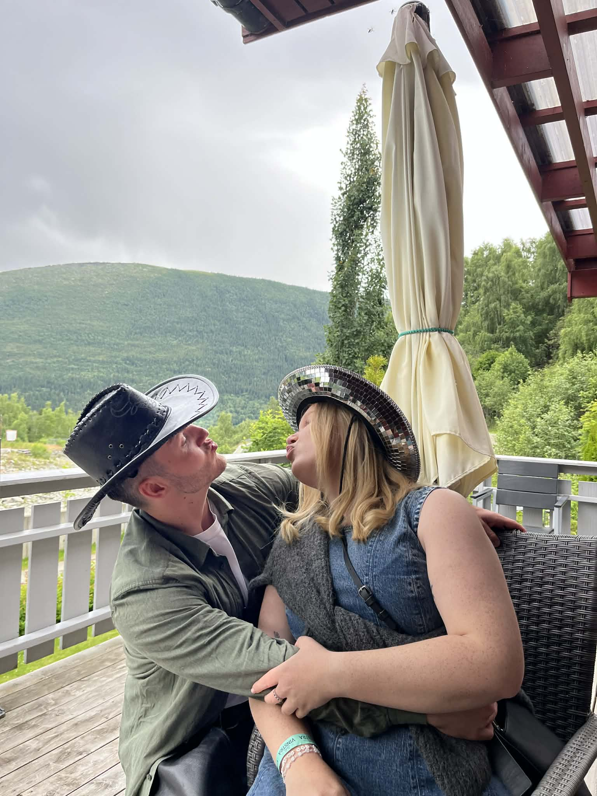

<!doctype html>
<html lang="no">
<head>
  <meta charset="utf-8" />
  <meta name="viewport" content="width=device-width,initial-scale=1" />
  <title>💗</title>

  
</head>

<body>
  

    

    <!-- Forsidebilde -->
    

      
    

    
Vil du være min valentine? 💘

    
Nei-knappen er på flukt. Det er bare én vei her 😈

    

      

        <button id="yesBtn">JA</button>
        <button id="noBtn">Nei</button>
      

    

  

  <!-- Modal 1: Etter JA -->
  

    

      
      

        <h2>Yesss! 🥹💞</h2>
        

          Ok, da er det offisielt. Du er min valentine. 🌹
        

        

          <button class="primary" id="moreBtn">Les mer om din valentine</button>
          <button class="ghost" id="closeYes">Lukk</button>
        

      

    

  

  <!-- Modal 2: Les mer om din valentine -->
  

    

      
      

        <h2>Om din valentine 💗</h2>
        

          Mathias møtte Emilie på videregående – og siden da har han vært helt ærlig: ekstremt heldig.
          I åtte år har du vært den beste “valentinen” han kunne fått.
            
          Han er skikkelig forelska i deg, og det største ønsket hans er å få dele selve valentinsdagen med deg.
          Når han ser på deg, tenker han at han har funnet drømmedama. Han er så glad for den du er – og han er stolt av deg, på ekte.
            
          Og så går det rykter… 👀 En liten baby på vei.
          Mathias klarer ikke å vente. Han mener barnet kommer til å bli det fineste mennesket i verden –
          spesielt når det kommer fra deg. 💞
        

        

          <button class="ghost" id="endMore">Avslutt</button>
        

      

    

  

  <!-- Modal 3: Vil du vite mer? -->
  

    

      

        <h2>Vil du vite mer? 😇</h2>
        

          Trykk på knappen, så får du siste “insight”.
        

        

          <button class="primary" id="revealBtn">Vil du vite mer?</button>
          <button class="ghost" id="closeQ">Lukk</button>
        

        

          Jeg elsker deg og gleder meg til helga! &lt;3
        

      

    

  

  
</body>
</html>
